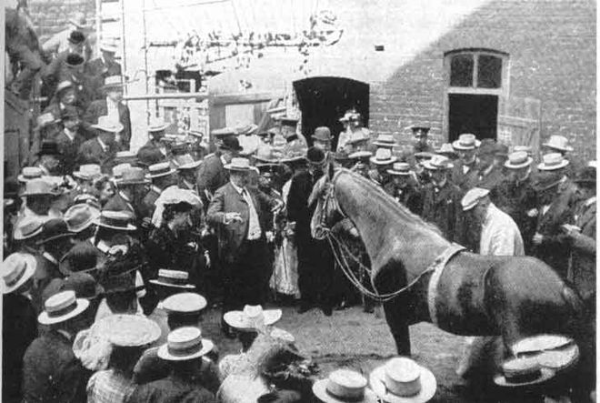
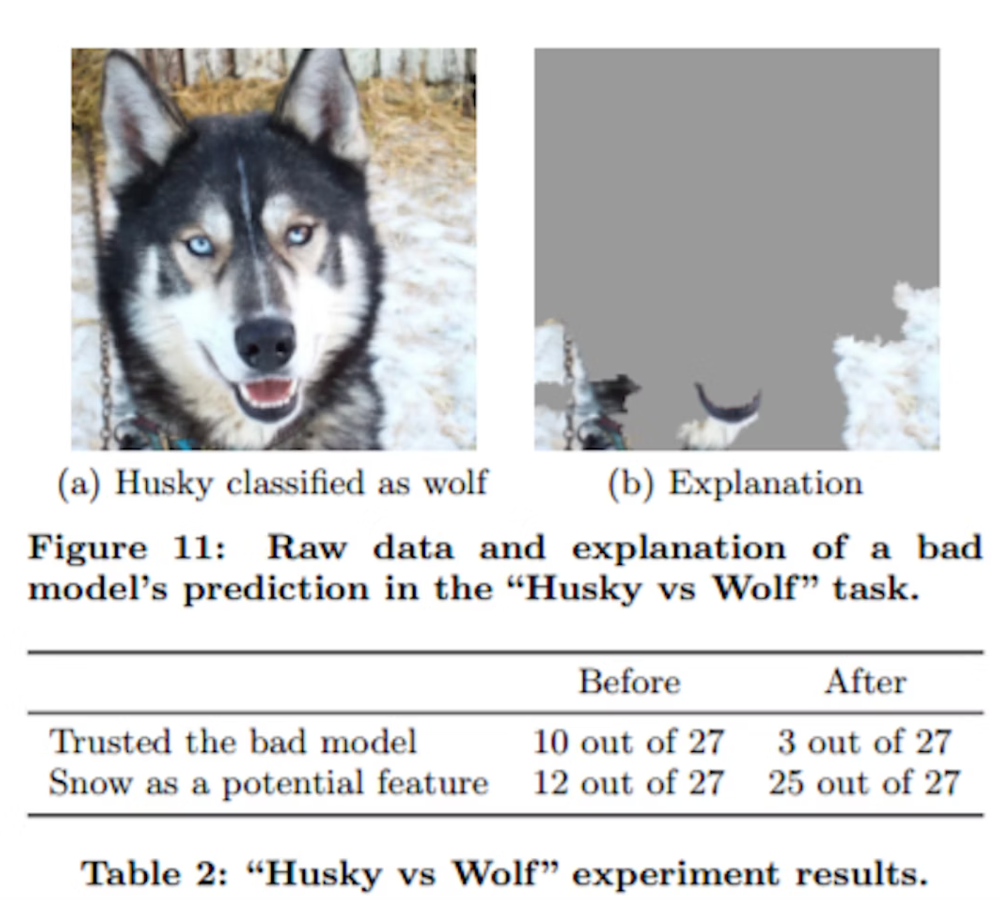
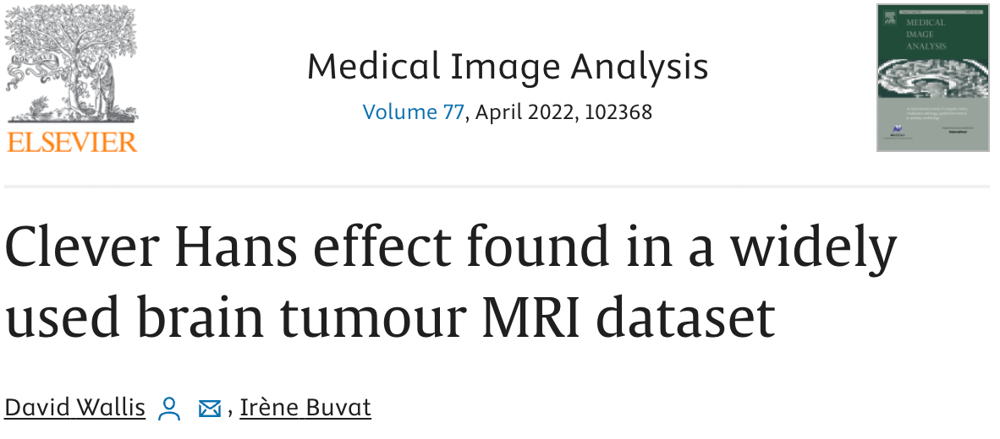

**The Tale of Clever Hans, the "Mathematical" Horse**

Once upon a time in Germany, around the early 1900s, there lived a horse named Hans. But he wasn't just any horse; he was "Clever Hans," a horse with a knack for numbers---or so people thought. Hans was owned by Wilhelm von Osten, a school teacher and horse trainer who claimed that Hans could understand German and solve complex mathematical problems. Imagine a horse doing your math homework!

Von Osten would ask Hans questions like "What is two plus three?" and Hans would tap his hoof five times. The crowd would go wild! "Ein Genie!" they exclaimed, which means "A genius!" in German. Hans became a celebrity, with people coming from far and wide to see the brainy horse who could count.

But, as with all great mysteries, there was a twist. A psychologist named Oskar Pfungst became curious about Hans's abilities. Pfungst conducted a series of experiments and discovered something astonishing. It turned out Hans was not exactly a mathematician; instead, he was incredibly good at reading human body language!

When von Osten or the audience knew the answer to a question, they would, without realizing it, give subtle, unintentional cues. A slight nod, a change in posture, or an eager look in their eyes. Hans was picking up on these tiny signals, and when the signals stopped---like when the audience held their breath in anticipation---he would stop tapping.

Hans was not a math whiz, but he was a master of observation, a Sherlock Holmes of the equine world!

**Relating Clever Hans to Explainable AI**

The story of Clever Hans is a humorous yet enlightening prelude to the importance of explainable AI. Just like how people believed Hans understood math, we often assume AI systems make decisions based on logical processing of the given inputs. However, sometimes, these systems might be 'tapping their hoof' based on subtle, unintended patterns in the data, not unlike Hans responding to unconscious human cues.

In AI, this is akin to a model picking up on noise, biases, or irrelevant patterns in the data, leading to correct outcomes for the wrong reasons. Just as Pfungst's investigation revealed the true nature of Hans's abilities, explainable AI aims to dissect and understand the 'how' and 'why' behind AI decisions. It's crucial to ensure AI systems are making decisions for the right reasons, especially in critical applications like healthcare, finance, and law.

So, the next time you encounter a seemingly "intelligent" AI, remember Clever Hans and ask yourself, "Is this AI genuinely smart, or is it just good at picking up on the digital equivalent of a nod and a wink?" The quest for explainable AI is, in essence, the pursuit of ensuring our AI systems are more than just clever at tapping hooves, but truly understanding and solving the problems at hand.

## Short-Cut Learning

"Short-cut learning" in the context of artificial intelligence and machine learning is a phenomenon where a model achieves the correct answer or output, but it does so for the wrong reasons. This concept is a bit like a student who correctly guesses the answers on a test without actually understanding the subject matter.

In more technical terms, short-cut learning occurs when a machine learning model picks up on superficial, spurious, or irrelevant patterns in the training data that happen to correlate with the right answers. These patterns are not the underlying causal factors that a human expert would use to make a decision. As a result, while the model may perform well on the training data or even some testing scenarios, its understanding is shallow and may fail in real-world situations where the spurious patterns it learned do not apply.

For example, imagine a medical AI trained to detect a certain disease from X-ray images. If most images of diseased lungs also coincidentally have a small marker or label on them that healthy lung images do not, the model might learn to identify the disease by looking for this marker instead of actual signs of the disease in the lung tissue. It gets the right answer (identifying the disease), but for the wrong reason (spotting the marker, not the disease characteristics).

Short-cut learning is a significant challenge in AI because it can lead to models that are brittle, biased, or ineffective in real-world conditions, despite showing high accuracy in controlled or test environments. It underscores the importance of robust, diverse datasets and the need for explainability in AI models to ensure that they are learning and reasoning correctly.

## The Clever Hans Effect

The process of finding artifacts in data that were not
intended to be used to make a prediction has become so
common that it now has its own name: "The Clever Hans Effect".

## Wolves and Dogs

In a study at the University of Washington, an image recognition system named [Iris](https://rad.washington.edu/research/equipment/image-research-and-informatics-server-iris/) was used to
classify images as containing Husky Dogs or Wolves. Iris was designed to identify and classify images with remarkable accuracy.

One day, the developers decided to test Iris's ability to distinguish between pictures of wolves and dogs. They fed Iris thousands of images, and to their delight, Iris correctly identified the wolves and dogs with near-perfect accuracy. The developers were ecstatic, believing they had perfected the algorithm.

However, there was something peculiar. They observed that in most of the wolf images, there was a common element: snow in the background. Intrigued, they decided to conduct an experiment. They fed Iris a set of new images, this time including pictures of dogs with snowy backgrounds.

To the developers' surprise, Iris started misclassifying these dogs as wolves. It became clear that Iris wasn't actually recognizing the animals based on their species-specific characteristics. Instead, the system had learned to associate wolves with snowy backgrounds, a shortcut that worked well until challenged by the new set of images.

This revelation was a moment of truth, reminiscent of the story of Clever Hans, the horse who had not actually learned arithmetic but was simply responding to subtle cues from his handler. Just like Hans, Iris wasn't as clever as it seemed; it was taking shortcuts based on unintended cues in the data.

The developers realized that their image recognition system, although powerful, was not truly understanding the content of the images. It was merely finding patterns, some of which were misleading. This was a humbling lesson in the complexity of AI and the importance of diverse and comprehensive data sets in training algorithms.

From that day on, the team approached their work with a new perspective, ensuring that Iris learned from a more varied and representative set of images, and they remained vigilant for any other "Clever Hans" effects that might skew their system's understanding of the world.

And so, the tale of Iris and the Clever Hans effect became a cautionary story in the world of AI, reminding everyone that even the most advanced systems might be taking shortcuts and that continuous scrutiny and improvement are key to developing truly intelligent machines.

## Clever Hans in Medical Images

A recent study has shed light on a significant issue within the field of medical image analysis, particularly in the use of machine learning. The researchers targeted a commonly used brain tumor MRI dataset available to the public, uncovering an inherent bias. This bias, the study suggests, originates from the unintentional influence of radiologists in the selection process of 2D slices for the dataset. The team conducted multiple experiments, revealing that this bias could lead to high accuracy rates in tumor classification, even when the actual tumor data is not considered. This critical finding, which has been overlooked in other studies using the same dataset, underscores the importance of thoroughly understanding machine learning models and their application in medical contexts. The study highlights the potential risks and misinterpretations that can arise from not fully comprehending these advanced technologies.

## References

* [Clever Hans effect found in a widely used brain tumour MRI dataset](https://www.sciencedirect.com/science/article/pii/S1361841522000214)
* [“Why Should I Trust You?” Explaining the Predictions of Any Classifier](https://arxiv.org/pdf/1602.04938.pdf)
* [Deep Learning, Meet Clever Hans](https://towardsdatascience.com/deep-learning-meet-clever-hans-3576144dc5a9)
* [Clever Hans on Wikipedia](https://en.wikipedia.org/wiki/Clever_Hans)
* [The “Clever Hans Phenomenon” revisited](https://www.ncbi.nlm.nih.gov/pmc/articles/PMC3921203/)