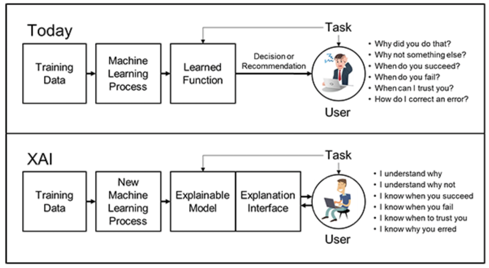

# DARPA XAI Model

The image above describes the DARPA reference model for explainable AI (XAI). We will look at this image and describe how the DARPA XAI model is different from the standard machine-learning process. We will then speculate if the box labeled "Explainable Model" could be created using a knowledge graph.

The image depicts two different approaches to machine learning: the traditional approach and the DARPA's Explainable AI (XAI) approach.

In the traditional machine learning approach:

1.  **Training Data** is used in the **Machine Learning Process** to create a **Learned Function**.
2.  This function is then used to make a **Decision or Recommendation**.
3.  The **User** then interacts with this decision or recommendation, often posing questions like:
    -   Why did you do that?
    -   Why not something else?
    -   When do you succeed?
    -   When do you fail?
    -   When can I trust you?
    -   How do I correct an error?

This traditional model often acts as a black box, providing little insight into how the decisions are made, which can be problematic for users who need to understand the reasoning behind the AI's outputs.

In contrast, the DARPA XAI model includes additional components for explainability:

1.  **Training Data** is still used in a **New Machine Learning Process** to create an **Explainable Model**.
2.  Along with the model, an **Explanation Interface** is also developed.
3.  The **User** then interacts with the model and interface, leading to a situation where the user can:
    -   Understand why the decision was made (I understand why).
    -   Understand the reasoning for not choosing an alternative (I understand why not).
    -   Know when the model is likely to succeed or fail.
    -   Know when to trust the model's decision.
    -   Understand the reasons behind any errors (I know why you erred).

The XAI model is designed to be transparent and provide users with insights into the machine learning process. This is particularly important in fields where understanding the decision-making process is crucial, such as healthcare, autonomous vehicles, or any domain where trust and reliability are paramount.

## Using a Knowledge Graph as the Explainable Model

Regarding the creation of the "Explainable Model" using a knowledge graph: Yes, it's a great idea! A knowledge graph can be leveraged to create an explainable model by linking data points with their relationships and properties in a graph structure. This graph can then be used to trace the decision-making path of the AI, showing how various inputs and their relationships contribute to a particular decision.

## Queryability

A knowledge graph allows users to query the model and receive explanations in terms of the relationships and entities within the knowledge graph, which can be highly informative and interpretable. This approach is particularly useful for complex domains where numerous variables and their interconnections must be considered, like in financial risk assessment or personalized medicine.